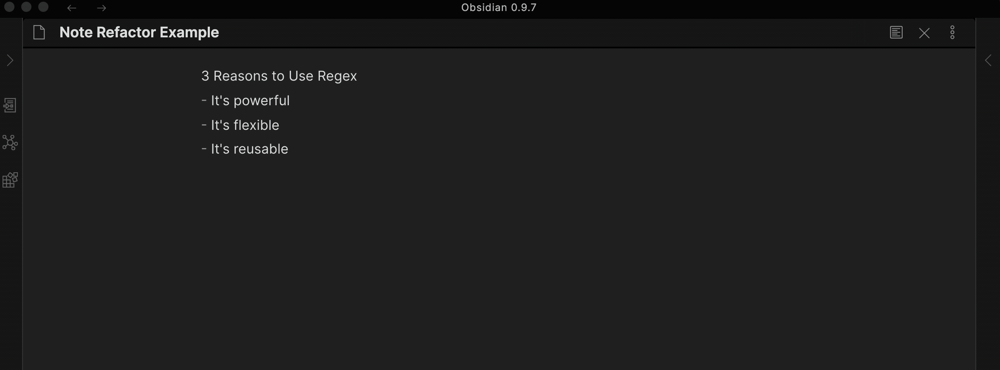

# note-refactor-obsidian

This repository contains a plugin for [Obsidian](https://obsidian.md/) for extracting the selected portion of a notes into new note. 

Credit to [MrJackphil](https://github.com/mrjackphil), this plugin is based on [the code snippet](https://forum.obsidian.md/t/code-snippet-extract-note/6698) he created.

The default hotkey is:

| Hotkey                                            | Action                                     |
| ------------------------------------------------- | ------------------------------------------ |
| <kbd>Ctrl/Cmd</kbd> + <kbd>Shift</kbd> + <kbd>N</kbd>                    | Copy selection into new note and replace with a link.                 |

The new note file is created at the root of the vault with the filename as the first line of the selected text and the content as the rest of the selected text.

Headings (`#`) characters and other illegal characters for filenames are removed including `:`, `\`, `/`.

## Demo

### First Line as Note File Name
This command copies the selected text into the content of a new note using the first line as the file name for the new note.

### Extract to Note Content Only
This command only copies the selected text into the content of a new note. The user is prompted to enter a file name for the new note.

DEMO TBC

### First Line included as Note Heading
A config setting allows for the first line of the selected text to be included in the new note content as a heading with a configurable heading format `#`, `##`, `###`... 

## Compatibility

Custom plugins are only available for Obsidian v0.9.7+.

The current API of this repo targets Obsidian **v0.9.7**. 

## Installing

1. Download the [latest release](https://github.com/lynchjames/note-refactor-obsidian/releases/latest)
1. Extract the note-refactor-obsidian folder from the zip to your vault's plugins folder: `<vault>/.obsidian/plugins/`  
Note: On some machines the `.obsidian` folder may be hidden. On MacOS you should be able to press `Command+Shift+Dot` to show the folder in Finder.
1. Reload Obsidian
1. If prompted about Safe Mode, you can disable safe mode and enable the plugin.

A check is done to avoid overwriting of existing files but...

    💥 PLEASE TRY IN A TEST VAULT FIRST..AND MAKE SURE TO BACKUP! 💥
